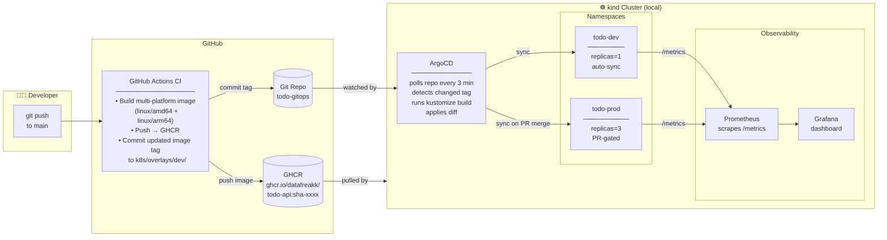
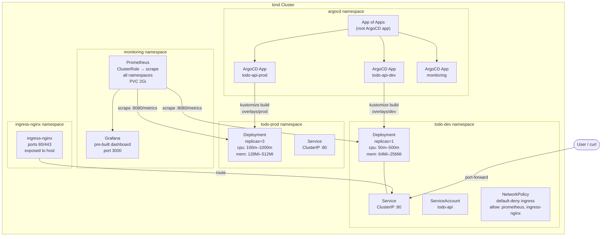
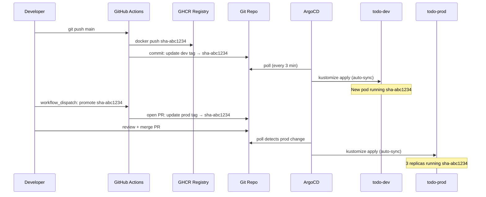

# todo-gitops

A production-like GitOps platform running locally on [kind](https://kind.sigs.k8s.io/), built for learning SRE and platform engineering concepts.

## What this repo is

A mono-repo containing a .NET 9 minimal API (TodoApi) and the full GitOps platform to deploy and operate it:

- **App** — TodoApi with REST endpoints, Prometheus metrics, and health checks
- **CI** — GitHub Actions builds a multi-platform Docker image, scans with Trivy, pushes to GHCR
- **CD** — ArgoCD watches this repo and automatically deploys changes to the local kind cluster
- **GitOps promotion** — dev deploys automatically on every push; prod requires a PR approval
- **Observability** — Prometheus scrapes metrics, Grafana shows a pre-built dashboard

## Architecture

### CI/CD GitOps Flow



### Cluster Internal Design



### Promotion Flow (dev → prod)



## Repo structure

```
todo-gitops/
├── app/                        # TodoApi .NET 9 source + Dockerfile
├── k8s/
│   ├── base/                   # shared k8s manifests (deployment, service, networkpolicy)
│   └── overlays/
│       ├── dev/                # dev: replicas=1, lighter resource limits, auto-sync
│       └── prod/               # prod: replicas=3, stricter limits, PR-gated promotion
├── argocd/
│   ├── install/                # ArgoCD install via Kustomize remote base (pinned v2.13.0)
│   └── apps/                   # App of Apps pattern — root app manages all child apps
├── monitoring/
│   ├── prometheus/             # Prometheus with ClusterRole for cross-namespace scraping
│   └── grafana/                # Grafana with pre-built TodoApi dashboard
└── local/
    ├── kind-config.yaml        # 1 control-plane + 2 workers, ports 80/443
    └── Makefile                # bootstrap commands (cluster, argocd, monitoring, port-forwards)
```

## API endpoints

| Method | Path | Description |
|--------|------|-------------|
| GET | `/todos` | List all todos |
| GET | `/todos/{id}` | Get todo by id |
| POST | `/todos` | Create todo `{"title": "..."}` |
| PUT | `/todos/{id}` | Update todo `{"title": "...", "isComplete": true}` |
| DELETE | `/todos/{id}` | Delete todo |
| GET | `/health` | Health check (used by k8s probes) |
| GET | `/metrics` | Prometheus metrics |

## Local setup

### Prerequisites
- Docker Desktop running
- `kind` — `brew install kind`
- `kubectl` — `brew install kubectl`

### Bootstrap (first time only)

```bash
# 1. Create kind cluster (1 control-plane + 2 workers)
make -f local/Makefile cluster-up

# 2. Install ArgoCD v2.13.0
make -f local/Makefile install-argocd

# 3. Apply App of Apps — ArgoCD takes over from here, including monitoring
make -f local/Makefile bootstrap-argocd
```

### Access UIs

```bash
# ArgoCD UI — https://localhost:8443 (user: admin, password printed after install)
make -f local/Makefile port-forward-argocd

# Grafana — http://localhost:3000 (admin/admin)
make -f local/Makefile port-forward-grafana

# Prometheus — http://localhost:9090
make -f local/Makefile port-forward-prometheus

# TodoApi (dev)
kubectl port-forward svc/todo-api -n todo-dev 8080:80
curl http://localhost:8080/health
curl http://localhost:8080/todos
```

### Check status

```bash
make -f local/Makefile status
```

## GitOps flow

### Dev (automatic)
1. Push to `main` → GitHub Actions builds image → pushes to GHCR
2. CI commits updated image tag to `k8s/overlays/dev/kustomization.yaml`
3. ArgoCD detects the commit → syncs `todo-dev` namespace automatically

### Prod (PR-gated)
1. Go to **Actions → Promote to Prod → Run workflow** and enter the image tag
2. Workflow opens a PR updating `k8s/overlays/prod/kustomization.yaml`
3. Review + merge PR → ArgoCD syncs `todo-prod` namespace

## Key design decisions

| Decision | Reason |
|----------|--------|
| Mono-repo | Simpler for learning; in production split app and infra repos for independent access control |
| Kustomize overlays (not Helm) | Plain YAML diffs in Git, no template syntax to debug |
| ArgoCD Kustomize remote base | Upgrades = bump tag in one line + PR; no vendored files |
| `targetRevision: main` + branch protection | Direct pushes blocked; every change goes through PR + CI |
| Multi-platform image (amd64+arm64) | amd64 for cloud/CI runners, arm64 for Apple Silicon local kind |
| GHCR (public) | Free, no credentials needed in cluster for public images |
| ClusterRole for Prometheus | Enables cross-namespace scraping (todo-dev + todo-prod → monitoring) |
| NetworkPolicy default-deny | Least-privilege networking; only prometheus and ingress-nginx allowed to reach app pods |
| Immutable image tags (SHA) | `sha-abc1234` not `latest`; every deployment is traceable to a Git commit |

## Teardown

```bash
make -f local/Makefile teardown
```
